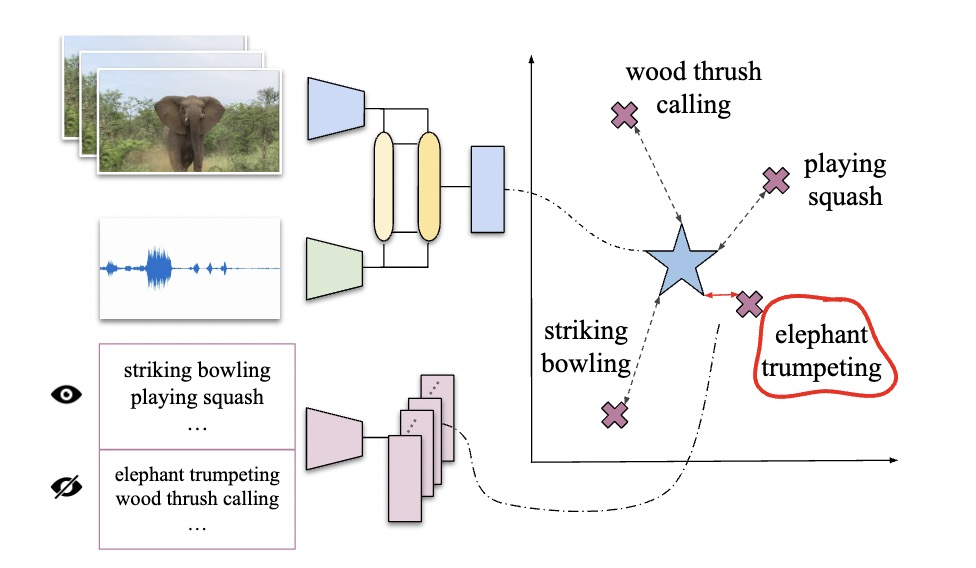

# Boosting Audio-visual Zero-shot Learning with Large Language Models

[](https://paperswithcode.com/sota/gzsl-video-classification-on-activitynet-gzsl?p=boosting-audio-visual-zero-shot-learning-with)
[](https://paperswithcode.com/sota/gzsl-video-classification-on-activitynet-gzsl-1?p=boosting-audio-visual-zero-shot-learning-with)
[](https://paperswithcode.com/sota/gzsl-video-classification-on-ucf-gzsl-cls?p=boosting-audio-visual-zero-shot-learning-with)
[](https://paperswithcode.com/sota/gzsl-video-classification-on-ucf-gzsl-main?p=boosting-audio-visual-zero-shot-learning-with)
[](https://paperswithcode.com/sota/gzsl-video-classification-on-vggsound-gzsl?p=boosting-audio-visual-zero-shot-learning-with)
[](https://paperswithcode.com/sota/gzsl-video-classification-on-vggsound-gzsl-1?p=boosting-audio-visual-zero-shot-learning-with)

This is the official code of the paper: Boosting Audio-visual Zero-shot Learning with Large Language Models.

> [**Boosting Audio-visual Zero-shot Learning with Large Language Models**](https://arxiv.org/abs/2311.12268)               
> [Haoxing Chen](https://scholar.google.com/citations?hl=zh-CN&pli=1&user=BnS7HzAAAAAJ), [Yaohui Li](https://scholar.google.com/citations?user=pC2kmQoAAAAJ&hl=zh-CN), [Yan Hong](https://scholar.google.com/citations?user=ztq5-xcAAAAJ&hl=zh-CN), Zizheng Huang, [Zhuoer Xu](https://scholar.google.com/citations?user=na24qQoAAAAJ&hl=zh-CN&oi=ao), [Zhangxuan Gu](https://scholar.google.com/citations?user=Wkp3s68AAAAJ&hl=zh-CN&oi=ao), Jun Lan, Huijia Zhu, [Weiqiang Wang](https://scholar.google.com/citations?hl=zh-CN&user=yZ5iffAAAAAJ), [arXiv preprint arXiv: 2311.12268](https://arxiv.org/abs/2311.12268) 

## Citing HDNet
If you use HDNet in your research, please use the following BibTeX entry.

```BibTeX
@article{KDA_2023,
      title={Boosting Audio-visual Zero-shot Learning with Large Language Models},
      author={Chen, Haoxing and Li, Yaohui and Hong, Yan and Xu, Zhuoer and Gu, Zhangxuan and Lan, Jun and Zhu, Huijia and Wang, Weiqiang},
      journal={arXiv preprint arXiv: 2311.12268},
      year={2023}
}
```

## Contacts
Please feel free to contact us if you have any problems.

Email: [haoxingchen@smail.nju.edu.cn](haoxingchen@smail.nju.edu.cn) or [hx.chen@hotmail.com](chen@hotmail.com)
